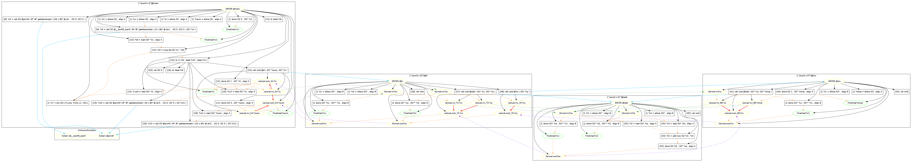

# llvm-slicing: Symbolic Program Slicing with LLVM

## Motivation    

Program slicing is a technique for simplifying programs by focusing on selected aspects of their behaviour. Current slicing techniques still have much room for improvement, such as handling programs written in multiple languages. Using the modern compilation framework [LLVM](http://llvm.org) (Low-Level Virtual Machine), we attempt in this project to meet this improvement by presenting a language-independent context-sensitive slicing approach, called `Symbolic Program Slicing`, including both backward and forward static slicing. In the symbolic slicing approach, slices are stored symbolically rather than procedure being re-analysed (cf. procedure summaries). For comparison, we systematically adapt SDG-based slicing methods with IFDS (Interprocedural Finite Distributive Subset analysis) to statically slice LLVM IR (intermediate representation). 

## Installation

`llvm-slicing` is written in [Haskell](https://www.haskell.org/). It depends on `LLVM 3.0-3.4` and `llvm-config` must be in your `PATH`. It is built and packaged using [`Cabal`](https://www.haskell.org/cabal/). 
 - Install the package `cabal-install` from your system's package manager (with e.g. `apt-get`);  
   Verify that `cabal` is installed and update its dependency list with  `cabal update`
 - `git clone` this repository, and `cd` to the `llvm-slicing` source directory (`src`) to build/install: `cabal install`.  
   This will compile `llvm-slicing` and install it to your `~/.cabal/bin` directory
 - Add this directory to your `PATH`;   Verify that your `PATH` is set up correctly with `which llvm-slicing`

Alternatively, download our pre-built binary for Ubuntu 12.04 LTS (64 bit) with LLVM 3.3:   
     [`llvm-slicing_llvm-3.3_x86-64_Ubuntu-12.04.2.tar.bz2`](bin/llvm-slicing_llvm-3.3_x86-64_Ubuntu-12.04.2.tar.bz2)   
Then unzip it and put the binary `llvm-slicing` in a directory that is on your `PATH`

## Usage

Currently, `llvm-slicing` includes four static slicers based on corresponding slicing methods, i.e. Symbolic slicing, Weiser slicing, SDG-based slicing (using intraprocedure slice result to generate summary edges), and IFDS-based slicing (using IFDS method to generate summary edges). To get detail help infomation:   

       $ llvm-slicing -h
    
       llvm-slicing [-c|--criterion VARIABLES] [-d|--direction DIRECTION]
                    [-m|--method SLICE_METHOD] [-p|--isParallel ISPARALLEL]
                    [-t|--timeout TIMEOUT] [-g|--graph GRAPH_SHOW]
                    [-o|--output FILE/DIR] FILE
 
       Available options:
         -h,--help                  Show this help text
         -c,--criterion VARIABLES   The criterion variables (with the form of Var@Fun,e.g. x@main) for slicing. 
                                    If null, just output the slice table for all single variables.
         -d,--direction DIRECTION   The type of output to slice: Fwd, Bwd or Both. Default: Bwd
         -m,--method SLICE_METHOD   The slice algorithm: Symbolic,Weiser,SDG or IFDS. Default: Symbolic
         -p,--isParallel ISPARALLEL Whether or not travelling SCC in callgraph in parallel. Default: False
         -t,--timeout TIMEOUT       The timeout (sec.) for running slicer. Default: 1800
         -g,--graph GRAPH_SHOW      Print related graphs: Sdg,Cg,Cdg,Cfg,Icfg,Pdt or Dt.
         -o,--output FILE/DIR       The destination of a file output
         FILE                       The input file which can be bitcode,llvm assembly, or C/CPP sourcecode

For a multi-programs library, it must be converted to LLVM bitcode (e.g. using the [whole-program LLVM](https://github.com/travitch/whole-program-llvm) wrapper to compile the library) before using `llvm-slicing` to slice it.

## Example

For a simple C program, [`sum3.c`](test/C/sample/sum3.c), its backward static slice table with symbolic slicing method:

      $ llvm-slicing sum3.c
      
      Backward Static SliceTable:
       Variable      SrcLineNumbers  
      ------------------------------
       a@add           {"sum3.c: [9,11,12,13,15,27,28,33,40,41]"}
       b@add           {"sum3.c: [9,12,13,15,27,28,33,40,41]"}
       i@main          {"sum3.c: [9,12,13,15,28,33,40,41]"}
       n@main          {"sum3.c: [9]"}
       sum@main        {"sum3.c: [9,11,12,13,15,27,28,33,40,41]"}
       tmp@inc         {"sum3.c: [9,12,13,15,28,33,40,41]"}
       x@A             {"sum3.c: [9,11,12,13,15,27,28,33,40,41]"}
       y@A             {"sum3.c: [9,12,13,15,28,33,40,41]"}
       z@inc           {"sum3.c: [9,12,13,15,28,33,40,41]"}

For simplicity, here backward slicing criteria can be automatically generated to slice on the last instruction (the first instruction for forward slicing criteria) of the main procedure for each global variable, and on the last instruction (the first definition instruction in forward slicing) of each procedure for each local variable allocated (declared) in the procedure. 

To get the final IR slice result of the local variable, `%z`, in the procedure `@inc` (on its last instruction):

      $ llvm-slicing sum3.c -c z@inc
  
      Backward Static Slice for ["z@inc"]:
       <SourceLines> ["sum3.c: [9,12,13,15,28,33,40,41]"]: 
        %n = alloca i32 , align 4
        %i = alloca i32 , align 4
        %4 = call i32 @__isoc99_scanf ( i8* i8* getelementptr ( [3 x i8]* @.str1 ,  i32 0, i32 0 ), i32* %n )
        store i32 1 , i32* %i , align 4
        %7 = phi i32 [ [%.pre, %10], [1, %0] ]
        %8 = load i32* %n , align 4
        %9 = icmp sle i32 %7 , %8
        br i1 %9 , label %10 , label %11
        call void @A ( i32* %sum, i32* %i )
        %.pre = load i32* %i , align 4
        i32* %y
        call void @inc ( i32* %y )
        i32* %a
        i32* %b
        %3 = load i32* %a , align 4
        %4 = load i32* %b , align 4
        %5 = add nsw i32 %3 , %4
        store i32 %5 , i32* %a , align 4
        i32* %z
        %tmp = alloca i32 , align 4
        store i32* %z , i32** %1 , align 8
        store i32 1 , i32* %tmp , align 4
        call void @add ( i32* %z, i32* %tmp )
 
 
To get its forward static slice table with IFDS-based slicing method:

      $ llvm-slicing sum3.c -d Fwd -m IFDS
       
      Forward Static SliceTable:
       Variable      SrcLineNumbers  
      ------------------------------
       a@add           {"sum3.c: [13,15,16,18,19,20,23,27,28,29,31,33,35,37,40,41,42]"}
       b@add           {"sum3.c: [13,15,16,18,19,20,23,27,28,29,31,33,35,37,40,41,42]"}
       i@main          {"sum3.c: [12,13,15,16,18,19,20,23,27,28,29,31,33,35,37,40,41,42]"}
       n@main          {"sum3.c: [9,13,15,16,18,19,20,23,27,28,29,31,33,35,37,40,41,42]"}
       sum@main        {"sum3.c: [11,18,33]"}
       tmp@inc         {"sum3.c: [13,15,16,18,19,20,23,27,28,29,31,33,35,37,40,41,42]"}
       x@A             {"sum3.c: [18,33]"}
       y@A             {"sum3.c: [13,15,16,18,19,20,23,27,28,29,31,33,35,37,40,41,42]"}
       z@inc           {"sum3.c: [13,15,16,18,19,20,23,27,28,29,31,33,35,37,40,41,42]"}
 
To print its SDG (system dependence graphs):

      $ llvm-slicing sum3.c -g Sdg
     
  

For more slice results of `sum3.c`, please visit the folder [`test/C/sample`](test/C/sample/).   
